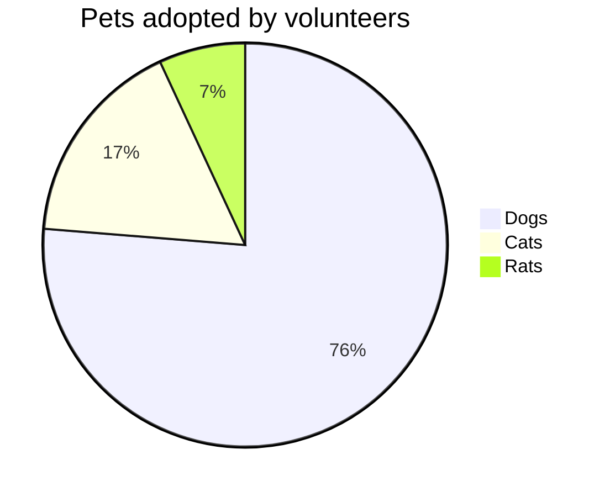

<h1 align="center">
  <a href="https://github.com/jeffreytse/jekyll-spaceship">
    
  </a>
  <br> 🚀 Jekyll Spaceship 🚀 <br>
</h1>

<h4 align="center">
  <a href="https://jekyllrb.org" target="_blank"><code>Jekyll</code></a> plugin for Astronauts.
</h4>

<p align="center">

  <a href="https://travis-ci.org/jeffreytse/jekyll-spaceship">
    
  </a>

  <a href="http://badge.fury.io/rb/jekyll-spaceship">
    
  </a>

  <a href="https://codeclimate.com/github/jeffreytse/jekyll-spaceship">
    
  </a>

  <a href="https://codeclimate.com/github/jeffreytse/jekyll-spaceship/test_coverage">
    
  </a>

  <a href="https://github.com/jeffreytse/jekyll-spaceship/blob/master/LICENSE.txt">
    
  </a>

  <a href="http://badge.fury.io/rb/jekyll-spaceship">
    
  </a>

</p>

<p align="center">

  <a href="https://liberapay.com/jeffreytse">
    
  </a>

  <a href="https://patreon.com/jeffreytse">
    
  </a>

  <a href="https://ko-fi.com/jeffreytse">
    
  </a>

</p>

<div align="center">
  <h4>
    <a href="#installation">Install</a> |
    <a href="#configuration">Config</a> |
    <a href="#usage">Usage</a> |
    <a href="#credits">Credits</a> |
    <a href="#license">License</a>
  </h4>
</div>

<div align="center">
  <sub>Built with ❤︎ by
  <a href="https://jeffreytse.net">jeffreytse</a> and
  <a href="https://github.com/jeffreytse/jekyll-spaceship/graphs/contributors">contributors </a>
</div>
<br>


Spaceship is a minimalistic, powerful and extremely customizable [Jekyll](https://jekyllrb.com/) plugin. It combines everything you may need for convenient work, without unnecessary complications, like a real spaceship.

<p align="center">
    
</p>

**💡 Tip:** I hope you enjoy using this plugin. If you like this project, **a little star** for it is your way make a clear statement: **My work is valued**. I would appreciate your support! _Thank you!_


## Table of Contents

- [Requirements](#requirements)
- [Installation](#installation)
- [Configuration](#configuration)
- [Usage](#usage)
  - [1. Table Usage](#1-table-usage)
    - [1.1 Rowspan and Colspan](#rowspan-and-colspan)
    - [1.2 Multiline](#multiline)
    - [1.3 Headerless](#headerless)
    - [1.4 Cell Alignment](#cell-alignment)
    - [1.5 Cell Markdown](#cell-markdown)
    - [1.6 Cell Inline Attributes](#cell-inline-attributes)
  - [2. MathJax Usage](#2-mathjax-usage)
    - [2.1 Performance Optimization](#21-performance-optimization)
    - [2.2 How to use?](#22-how-to-use)
  - [3. PlantUML Usage](#3-plantuml-usage)
  - [4. Mermaid Usage](#4-mermaid-usage)
  - [5. Media Usage](#5-media-usage)
    - [5.1 Youtube Usage](#youtube-usage)
    - [5.2 Vimeo Usage](#vimeo-usage)
    - [5.3 DailyMotion Usage](#dailymotion-usage)
    - [5.4 Spotify Usage](#spotify-usage)
    - [5.4 Spotify Podcast Usage](#spotify-podcast-usage)
    - [5.5 SoundCloud Usage](#soundcloud-usage)
    - [5.6 General Video Usage](#general-video-usage)
    - [5.7 General Audio Usage](#general-audio-usage)
  - [6. Hybrid HTML with Markdown](#6-hybrid-html-with-markdown)
  - [7. Markdown Polyfill](#7-markdown-polyfill)
    - [7.1 Escape Ordered List](#71-escape-ordered-list)
  - [8. Emoji Usage](#8-emoji-usage)
    - [8.1 Emoji Customizing](#81-emoji-customizing)
  - [9. Modifying Element Usage](#9-modifying-element-usage)
- [Credits](#credits)
- [Contributing](#contributing)
- [License](#license)

## Requirements

- Ruby >= 2.3.0

## Installation

Add jekyll-spaceship plugin in your site's `Gemfile`, and run `bundle install`.

```ruby
gem 'jekyll-spaceship'
```

Add jekyll-spaceship to the `plugins:` section in your site's `_config.yml`.

```yml
plugins:
  - jekyll-spaceship
```

**💡 Tip:** Note that GitHub Pages runs in `safe` mode and only allows [a set of whitelisted plugins](https://pages.github.com/versions/). To use the gem in GitHub Pages, you need to build locally or use CI (e.g. [travis](https://travis-ci.org/), [github workflow](https://help.github.com/en/actions/configuring-and-managing-workflows/configuring-a-workflow)) and deploy to your `gh-pages` branch.

### Additions for Unlimited GitHub Pages

* Here is a GitHub Action named [jekyll-deploy-action](https://github.com/jeffreytse/jekyll-deploy-action) for Jekyll site deployment conveniently. 👍
* Here is a [Jekyll site](https://github.com/jeffreytse/jekyll-jeffreytse-blog) using Travis to build and deploy to GitHub Pages for your references.

## Configuration

This plugin runs with the following configuration options by default. Alternative settings for these options can be explicitly specified in the configuration file `_config.yml`.

```yml
# Where things are
jekyll-spaceship:
  # default enabled processors
  processors:
    - table-processor
    - mathjax-processor
    - plantuml-processor
    - mermaid-processor
    - polyfill-processor
    - media-processor
    - emoji-processor
    - element-processor
  mathjax-processor:
    src:
      - https://polyfill.io/v3/polyfill.min.js?features=es6
      - https://cdn.jsdelivr.net/npm/mathjax@3/es5/tex-mml-chtml.js
    config:
      tex:
        inlineMath:
          - ['$','$']
          - ['\(','\)']
        displayMath:
          - ['$$','$$']
          - ['\[','\]']
      svg:
        fontCache: 'global'
    optimize: # optimization on building stage to check and add mathjax scripts
      enabled: true # value `false` for adding to all pages
      include: []   # include patterns for math expressions checking (regexp)
      exclude: []   # exclude patterns for math expressions checking (regexp)
  plantuml-processor:
    mode: default  # mode value 'pre-fetch' for fetching image at building stage
    css:
      class: plantuml
    syntax:
      code: 'plantuml!'
      custom: ['@startuml', '@enduml']
    src: http://www.plantuml.com/plantuml/svg/
  mermaid-processor:
    mode: default  # mode value 'pre-fetch' for fetching image at building stage
    css:
      class: mermaid
    syntax:
      code: 'mermaid!'
      custom: ['@startmermaid', '@endmermaid']
    config:
      theme: default
    src: https://mermaid.ink/svg/
  media-processor:
    default:
      id: 'media-{id}'
      class: 'media'
      width: '100%'
      height: 350
      frameborder: 0
      style: 'max-width: 600px; outline: none;'
      allow: 'encrypted-media; picture-in-picture'
  emoji-processor:
    css:
      class: emoji
    src: https://github.githubassets.com/images/icons/emoji/
```

## Usage

### 1. Table Usage

**For now, these extended features are provided:**

- Cells spanning multiple columns
- Cells spanning multiple rows
- Cells text align separately
- Table header not required
- Grouped table header rows or data rows

Noted that GitHub filters out style property, so the example displays with the obsolete align property. But in actual this plugin outputs style property with text-align CSS attribute.

#### Rowspan and Colspan

^^ in a cell indicates it should be merged with the cell above.  
This feature is contributed by [pmccloghrylaing](https://github.com/pmccloghrylaing).

```markdown
|              Stage | Direct Products | ATP Yields |
| -----------------: | --------------: | ---------: |
|         Glycolysis |          2 ATP              ||
| ^^                 |          2 NADH |   3--5 ATP |
| Pyruvaye oxidation |          2 NADH |      5 ATP |
|  Citric acid cycle |          2 ATP              ||
| ^^                 |          6 NADH |     15 ATP |
| ^^                 |          2 FADH |      3 ATP |
|                               30--32 ATP        |||
```

Code above would be parsed as:

<table>
<thead>
<tr>
<th align="right">Stage</th>
<th align="right">Direct Products</th>
<th align="right">ATP Yields</th>
</tr>
</thead>
<tbody>
<tr>
<td align="right" rowspan="2">Glycolysis</td>
<td align="right" colspan="2">2 ATP</td>
</tr>
<tr>
<td align="right">2 NADH</td>
<td align="right">3–5 ATP</td>
</tr>
<tr>
<td align="right">Pyruvaye oxidation</td>
<td align="right">2 NADH</td>
<td align="right">5 ATP</td>
</tr>
<tr>
<td align="right" rowspan="3">Citric acid cycle</td>
<td align="right" colspan="2">2 ATP</td>
</tr>
<tr>
<td align="right">6 NADH</td>
<td align="right">15 ATP</td>
</tr>
<tr>
<td align="right">2 FADH2</td>
<td align="right">3 ATP</td>
</tr>
<tr>
<td align="right" colspan="3">30–32 ATP</td>
</tr>
</tbody>
</table>

#### Multiline

A backslash at end to join cell contents with the following lines.  
This feature is contributed by [Lucas-C](https://github.com/Lucas-C).

```markdown
| :    Easy Multiline   : |||
| :----- | :----- | :------ |
| Apple  | Banana | Orange  \
| Apple  | Banana | Orange  \
| Apple  | Banana | Orange
| Apple  | Banana | Orange  \
| Apple  | Banana | Orange  |
| Apple  | Banana | Orange  |
```

Code above would be parsed as:

<table>
<thead>
<tr>
<th align="center" colspan="3">Easy Multiline</th>
</tr>
</thead>
<tbody>
<tr>
<td align="left">Apple<br>Apple<br>Apple</td>
<td align="left">Banana<br>Banana<br>Banana</td>
<td align="left">Orange<br>Orange<br>Orange</td>
</tr>
<tr>
<td align="left">Apple<br>Apple</td>
<td align="left">Banana<br>Banana</td>
<td align="left">Orange<br>Orange</td>
</tr>
<tr>
<td align="left">Apple</td>
<td align="left">Banana</td>
<td align="left">Orange</td>
</tr>
</tbody>
</table>

#### Headerless

Table header can be eliminated.

```markdown
|--|--|--|--|--|--|--|--|
|♜| |♝|♛|♚|♝|♞|♜|
| |♟|♟|♟| |♟|♟|♟|
|♟| |♞| | | | | |
| |♗| | |♟| | | |
| | | | |♙| | | |
| | | | | |♘| | |
|♙|♙|♙|♙| |♙|♙|♙|
|♖|♘|♗|♕|♔| | |♖|
```

Code above would be parsed as:

<table>
<tbody>
<tr>
<td>♜</td>
<td></td>
<td>♝</td>
<td>♛</td>
<td>♚</td>
<td>♝</td>
<td>♞</td>
<td>♜</td>
</tr>
<tr>
<td></td>
<td>♟</td>
<td>♟</td>
<td>♟</td>
<td></td>
<td>♟</td>
<td>♟</td>
<td>♟</td>
</tr>
<tr>
<td>♟</td>
<td></td>
<td>♞</td>
<td></td>
<td></td>
<td></td>
<td></td>
<td></td>
</tr>
<tr>
<td></td>
<td>♗</td>
<td></td>
<td></td>
<td>♟</td>
<td></td>
<td></td>
<td></td>
</tr>
<tr>
<td></td>
<td></td>
<td></td>
<td></td>
<td>♙</td>
<td></td>
<td></td>
<td></td>
</tr>
<tr>
<td></td>
<td></td>
<td></td>
<td></td>
<td></td>
<td>♘</td>
<td></td>
<td></td>
</tr>
<tr>
<td>♙</td>
<td>♙</td>
<td>♙</td>
<td>♙</td>
<td></td>
<td>♙</td>
<td>♙</td>
<td>♙</td>
</tr>
<tr>
<td>♖</td>
<td>♘</td>
<td>♗</td>
<td>♕</td>
<td>♔</td>
<td></td>
<td></td>
<td>♖</td>
</tr>
</tbody>
</table>

#### Cell Alignment

Markdown table syntax use colons ":" for forcing column alignment.  
Therefore, here we also use it for forcing cell alignment.

Table cell can be set alignment separately.

```markdown
| :        Fruits \|\| Food       : |||
| :--------- | :-------- | :--------  |
| Apple      | : Apple : | Apple      \
| Banana     |   Banana  | Banana     \
| Orange     |   Orange  | Orange     |
| :   Rowspan is 4    : || How's it?  |
|^^    A. Peach         ||   1. Fine :|
|^^    B. Orange        ||^^ 2. Bad   |
|^^    C. Banana        ||  It's OK!  |
```

Code above would be parsed as:

<table>
<thead>
<tr>
<th align="center" colspan="3">Fruits || Food
</tr>
</thead>
<tbody>
<tr>
<td align="left">Apple<br>Banana<br>Orange</td>
<td align="center">Apple<br>Banana<br>Orange</td>
<td align="left">Apple<br>Banana<br>Orange</td>
</tr>
<tr>
<td align="center" rowspan="4" colspan="2">
Rowspan is 4
<br>A. Peach
<br>B. Orange
<br>C. Banana
</td>
</tr>
<tr>
<td align="left">How's it?</td>
</tr>
<tr>
<td align="right">1. Fine<br>2. Bad</td>
</tr>
<tr>
<td align="left">It' OK!</td>
</tr>
</tbody>
</table>

#### Cell Markdown

Sometimes we may need some abundant content (e.g., mathjax, image, video) in Markdown table  
Therefore, here we also make markown syntax possible inside a cell.

```markdown
| :                   MathJax \|\| Image                 : |||
| :------------ | :-------- | :----------------------------- |
| Apple         | : Apple : | Apple                          \
| Banana        | Banana    | Banana                         \
| Orange        | Orange    | Orange                         |
| :     Rowspan is 4     : || :        How's it?           : |
| ^^     A. Peach          ||    1. ![example][cell-image]   |
| ^^     B. Orange         || ^^ 2. $I = \int \rho R^{2} dV$ |
| ^^     C. Banana         || **It's OK!**                   |

[cell-image]: https://jekyllrb.com/img/octojekyll.png "An exemplary image"
```

Code above would be parsed as:

<table>
<thead>
<tr>
<th align="center" colspan="3">MathJax || Image
</tr>
</thead>
<tbody>
<tr>
<td align="left">Apple<br>Banana<br>Orange</td>
<td align="center">Apple<br>Banana<br>Orange</td>
<td align="left">Apple<br>Banana<br>Orange</td>
</tr>
<tr>
<td align="center" rowspan="4" colspan="2">
Rowspan is 4
<br>A. Peach
<br>B. Orange
<br>C. Banana
</td>
</tr>
<tr>
<td align="center">How's it?</td>
</tr>
<tr>
<td align="left">
<ol>
<li></img></li>
<li></img></li>
</ol>
</td>
</tr>
<tr>
<td align="left"><b>It' OK!</b></td>
</tr>
</tbody>
</table>

#### Cell Inline Attributes

This feature is very useful for custom cell such as using inline style. (e.g., background, color, font)  
The idea and syntax comes from the [Maruku](http://maruku.rubyforge.org/) package.  

[](https://kramdown.gettalong.org/syntax.html#block-ials)

Following are some examples of attributes definitions (ALDs) and afterwards comes the syntax explanation:

```markdown
{:ref-name: #id .cls1 .cls2}
{:second: ref-name #id-of-other title="hallo you"}
{:other: ref-name second}
```

An ALD line has the following structure:

- a left brace, optionally preceded by up to three spaces,
- followed by a colon, the id and another colon,
- followed by attribute definitions (allowed characters are backslash-escaped closing braces or any character except a not escaped closing brace),
- followed by a closing brace and optional spaces until the end of the line.

If there is more than one ALD with the same reference name, the attribute definitions of all the ALDs are processed like they are defined in one ALD.

An inline attribute list (IAL) is used to attach attributes to another element.  
Here are some examples for span IALs:

```markdown
{: #id .cls1 .cls2} <!-- #id <=> id="id", .cls1 .cls2 <=> class="cls1 cls2" -->
{: ref-name title="hallo you"}
{: ref-name class='.cls3' .cls4}
```

Here is an example for custom table cell with IAL:

```markdown
{:color-style: style="background: black;"}
{:color-style: style="color: white;"}
{:text-style: style="font-weight: 800; text-decoration: underline;"}

|:             Here's an Inline Attribute Lists example                :||||
| ------- | ------------------ | -------------------- | ------------------ |
|:       :|:  <div style="color: red;"> &lt; Normal HTML Block > </div> :|||
| ^^      |   Red    {: .cls style="background: orange" }                |||
| ^^ IALs |   Green  {: #id style="background: green; color: white" }    |||
| ^^      |   Blue   {: style="background: blue; color: white" }         |||
| ^^      |   Black  {: color-style text-style }                         |||
```

Code above would be parsed as:


Additionally, [here](https://kramdown.gettalong.org/syntax.html#block-ials) you can learn more details about IALs.

### 2. MathJax Usage

[MathJax](http://www.mathjax.org/) is an open-source JavaScript display engine for LaTeX, MathML, and AsciiMath notation that works in all modern browsers.

Some of the main features of MathJax include:

- High-quality display of LaTeX, MathML, and AsciiMath notation in HTML pages
- Supported in most browsers with no plug-ins, extra fonts, or special
  setup for the reader
- Easy for authors, flexible for publishers, extensible for developers
- Supports math accessibility, cut-and-paste interoperability, and other
  advanced functionality
- Powerful API for integration with other web applications

#### 2.1 Performance optimization

At building stage, the MathJax engine script will be added by automatically checking whether there is a math expression in the page, this feature can help you improve the page performance  on loading speed.

#### 2.2 How to use?

Put your math expression within \$...\$

```markdown
$ a * b = c ^ b $
```

```markdown
$ 2^{\frac{n-1}{3}} $
```

```markdown
$ \int\_a^b f(x)\,dx. $
```

Code above would be parsed as:

<image alt="MathJax Expression" height="180" src="https://user-images.githubusercontent.com/9413601/82814245-5a5ed180-9ec9-11ea-9d5b-fba303c627ac.png"></image>

### 3. PlantUML Usage

[PlantUML](https://plantuml.com) is a component that allows to quickly write:

- sequence diagram,
- use case diagram,
- class diagram,
- activity diagram,
- component diagram,
- state diagram,
- object diagram

There are two ways to create a diagram in your Jekyll blog page:

````
```plantuml!
Bob -> Alice : hello world
```
````

or

```markdown
@startuml
Bob -> Alice : hello
@enduml
```

Code above would be parsed as:


### 4. Mermaid Usage

[Mermaid](https://mermaid-js.github.io/) is a Javascript based diagramming and charting tool. It generates diagrams flowcharts and more, using markdown-inspired text for ease and speed.

It allows to quickly write:

- flow chart,
- pie chart,
- sequence diagram,
- class diagram,
- state diagram,
- entity relationship diagram,
- user journey,
- gantt

There are two ways to create a diagram in your Jekyll blog page:

````

````

or

```markdown
@startmermaid
pie title Pets adopted by volunteers
  "Dogs" : 386
  "Cats" : 85
  "Rats" : 35
@endmermaid
```

Code above would be parsed as:


### 5. Media Usage

How often did you find yourself googling "**How to embed a video/audio in markdown?**"

While its not possible to embed a video/audio in markdown, the best and easiest
way is to extract a frame from the video/audio. To add videos/audios to your
markdown files easier I developped this tool for you, and it will parse the
video/audio link inside the image block automatically.

**For now, these media links parsing are provided:**

- Youtube
- Vimeo
- DailyMotion
- Spotify
- SoundCloud
- General Video ( mp4 | avi | ogg | ogv | webm | 3gp | flv | mov ... )
- General Audio ( mp3 | wav | ogg | mid | midi | aac | wma ... )

There are two ways to embed a video/audio in your Jekyll blog page:

Inline-style:

```markdown

```

Reference-style:

```markdown
![][{reference}]

[{reference}]: {media-link}
```

For configuring media attributes (e.g, width, height), just adding query string to
the link as below:

```markdown


```

#### Youtube Usage

```markdown


```

#### Vimeo Usage

```markdown


```

#### DailyMotion Usage

```markdown


```

#### Spotify Usage

```markdown

```

<image width="600" src="https://user-images.githubusercontent.com/9413601/89762618-5d11b000-db23-11ea-81db-35cc3682b234.png">

#### Spotify Podcast Usage

```markdown

```

<image width="600" src="https://user-images.githubusercontent.com/9413601/133599796-1d213033-8184-4059-9ec2-5415e50c94dc.png">


#### SoundCloud Usage

```markdown

```

<image width="600" src="https://user-images.githubusercontent.com/9413601/89762969-1c666680-db24-11ea-97e3-4340f7fac7ac.png">

#### General Video Usage

```markdown


```

#### General Audio Usage

```markdown


```

<image width="300" src="https://user-images.githubusercontent.com/9413601/89762143-68181080-db22-11ea-8467-e8b2a8a96ae5.png">

### 6. Hybrid HTML with Markdown

As markdown is not only a lightweight markup language with plain-text-formatting syntax, but also an easy-to-read and easy-to-write plain text format, so writing a hybrid HTML with markdown is an awesome choice.

It's easy to write markdown inside HTML:

```html
<script type="text/markdown">
# Hybrid HTML with Markdown is a not bad choice ^\_^

## Table Usage

| :        Fruits \|\| Food       : |||
| :--------- | :-------- | :--------  |
| Apple      | : Apple : | Apple      \
| Banana     |   Banana  | Banana     \
| Orange     |   Orange  | Orange     |
| :   Rowspan is 4    : || How's it?  |
|^^    A. Peach         ||   1. Fine :|
|^^    B. Orange        ||^^ 2. Bad   |
|^^    C. Banana        ||  It's OK!  |

## PlantUML Usage

@startuml
Bob -> Alice : hello
@enduml

## Video Usage


</script>
```

### 7. Markdown Polyfill

It allows us to polyfill features for extending markdown syntax.

**For now, these polyfill features are provided:**

- Escape ordered list

#### 7.1 Escape Ordered List

A backslash at begin to escape the ordered list.

```markdown
Normal:

1. List item Apple.
3. List item Banana.
10. List item Cafe.

Escaped:

\1. List item Apple.
\3. List item Banana.
\10. List item Cafe.
```

Code above would be parsed as:

```markdown
Normal:

1. List item Apple.
2. List item Banana.
3. List item Cafe.

Escaped:

1. List item Apple.
3. List item Banana.
10. List item Cafe.
```

### 8. Emoji Usage
GitHub-flavored emoji images and names would allow emojifying content such as: it's raining :cat:s and :dog:s!

Noted that emoji images are served from the GitHub.com CDN, with a base URL of [https://github.githubassets.com](https://github.githubassets.com), which results in emoji image URLs like [https://github.githubassets.com/images/icons/emoji/unicode/1f604.png](https://github.githubassets.com/images/icons/emoji/unicode/1f604.png).

In any page or post, use emoji as you would normally, e.g.

```
I give this plugin two :+1:!
```

**Code above would be parsed as:**

I give this plugin two :+1:!

#### 8.1 Emoji Customizing

If you'd like to serve emoji images locally, or use a custom emoji source, you can specify so in your `_config.yml` file:

```yml
jekyll-spaceship:
  emoji-processor:
    src: "/assets/images/emoji"
```

See the [Gemoji](https://github.com/github/gemoji) documentation for generating image files.

### 9. Modifying Element Usage

It allows us to modify elements via `CSS3 selectors`. Through it you can easily
modify the attributes of an element tag, replace the children nodes and so on, 
it's very flexible, but here is example usage for modifying a document:

```yml
# Here is a comprehensive example
jekyll-spaceship:
  element-processor:
    css:
      - a: '<h1>Test</h1>'                     # Replace all `a` tags (String Style)
      - ['a.link1', 'a.link2']:                # Replace all `a.link1`, `a.link2` tags (Hash Style)
          name: img                            # Replace element tag name
          props:                               # Replace element properties
            title: Good image                  # Add a title attribute
            src: ['(^.*$)', '\0?a=123']        # Add query string to src attribute by regex pattern
            style:                             # Add style attribute (Hash Style)
              color: red
              font-size: '1.2em'
          children:                            # Add children to the element
            -                                  # First empty for adding after the last child node
            - "<span>Google</span>"            # First child node (String Style)
            -                                  # Middle empty for wrapping the children nodes
            - name: span                       # Second child node (Hash Style)
              props:
                prop1: "1"                     # Custom property1
                prop2: "2"                     # Custom property2
                prop3: "3"                     # Custom property3
              children:                        # Add nested chidren nodes
                - "<span>Jekyll</span>"        # First child node (String Style)
                - name: span                   # Second child node (Hash Style)
                  props:                       # Add attributes to child node (Hash Style)
                    prop1: "a"
                    prop2: "b"
                    prop3: "c"
                  children: "<b>Yap!</b>"      # Add children nodes (String Style)
            -                                  # Last empty for adding before the first child node
      - a.link: '<a href="//t.com">Link</a>'   # Replace all `a.link` tags (String Style)
      - 'h1#title':                            # Replace `h1#title` tags (Hash Style)
          children: I'm a title!               # Replace inner html to new text
```

#### Example 1

Automatically adds a `target="_blank" rel="noopener noreferrer"` attribute to all external links in Jekyll's content.

```yml
jekyll-spaceship:
  element-processor:
    css:
      - a:                                     # Replace all `a` tags
          props:
            class: ['(^.*$)', '\0 ext-link']   # Add `ext-link` to class by regex pattern
            target: _blank                     # Replace `target` value to `_blank`
            rel: noopener noreferrer           # Replace `rel` value to `noopener noreferrer`
```

#### Example 2

Automatically adds `loading="lazy"` to `img` and `iframe` tags to natively load lazily.
[Browser support](https://caniuse.com/#feat=loading-lazy-attr) is growing. If a browser does not support the `loading` attribute, it will load the resource just like it would normally.

```yml
jekyll-spaceship:
  element-processor:
    css:
      - a:                                     # Replace all `a` tags
          props:                               #
            loading: lazy                      # Replace `loading` value to `lazy`
```

In case you want to prevent loading some images/iframes lazily, add
`loading="eager"` to their tags. This might be useful to prevent flickering of
images during navigation (e.g. the site's logo).

See the following examples to prevent lazy loading.

```yml
jekyll-spaceship:
  element-processor:
    css:
      - a:                                     # Replace all `a` tags
          props:                               #
            loading: eager                     # Replace `loading` value to `eager`
```

There are three options when using this method to lazy load images. Here are the supported values for the loading attribute:

- auto: Default lazy-loading behavior of the browser, which is the same as not including the attribute.
- lazy: Defer loading of the resource until it reaches a calculated distance from the viewport.
- eager: Load the resource immediately, regardless of where it’s located on the page.


## Credits

- [Jekyll](https://github.com/jekyll/jekyll) - A blog-aware static site generator in Ruby.
- [MultiMarkdown](https://fletcher.github.io/MultiMarkdown-6) - Lightweight markup processor to produce HTML, LaTeX, and more.
- [markdown-it-multimd-table](https://github.com/RedBug312/markdown-it-multimd-table) - Multimarkdown table syntax plugin for markdown-it markdown parser.
- [jmoji](https://github.com/jekyll/jemoji) - GitHub-flavored emoji plugin for Jekyll.
- [jekyll-target-blank](https://github.com/keithmifsud/jekyll-target-blank) - Automatically opens external links in a new browser for Jekyll Pages, Posts and Docs.
- [jekyll-loading-lazy](https://github.com/gildesmarais/jekyll-loading-lazy) - Automatically adds loading="lazy" to img and iframe tags to natively load lazily.
- [mermaid](https://github.com/mermaid-js/mermaid) - Generation of diagram and flowchart from text in a similar manner as markdown.

## Contributing

Issues and Pull Requests are greatly appreciated. If you've never contributed to an open source project before I'm more than happy to walk you through how to create a pull request.

You can start by [opening an issue](https://github.com/jeffreytse/jekyll-spaceship/issues/new) describing the problem that you're looking to resolve and we'll go from there.

## License

This software is licensed under the [MIT license](https://opensource.org/licenses/mit-license.php) © JeffreyTse.
